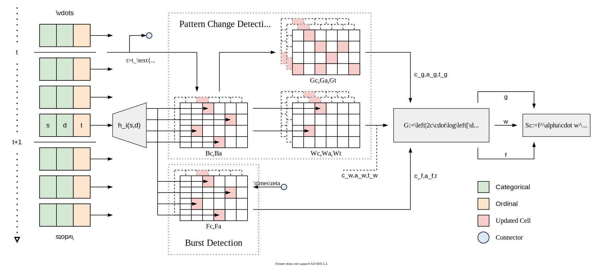

= Isconna
Rui LIU (@liurui39660)
:toc: macro
:toc-title:

image:https://github.com/liurui39660/Isconna/actions/workflows/Test.Demo.yml/badge.svg[]

C++ implementation of

* https://arxiv.org/pdf/2104.01632.pdf[Isconna: Streaming Anomaly Detection with Frequency and Patterns]. _Rui Liu, Siddharth Bhatia, Bryan Hooi_. (Under Review)

[discrete]
=== Table of Contents

toc::[]

== Demo

If you find `dep/AUROC` and `dep/mio` are empty, use this command to clone the dependencies.

`git submodule update --init`

The following steps are necessary before choosing the standalone or the docker build.

. Open a terminal (Linux/macOS) or a Visual Studio Developer Command Prompt (Windows)
. `cd` to the project root `Isconna`
. `mkdir out`
. `tar -xf data/data.zip -C data` (Windows)
** Or `unzip data/data.zip -d data` (Linux/macOS)
** Or `7z x data/data.zip -odata`

=== Standalone

If you want to build and run directly on your machine ...

. `cmake -DCMAKE_BUILD_TYPE=Release -GNinja -S . -B build/release`
** Remove `-GNinja` if you don't have https://github.com/ninja-build/ninja/releases/latest[`ninja`]
. `cmake --build build/release --target Demo`
. `build\release\Demo.exe` (Windows) or `build/release/Demo` (Linux/macOS)

The demo runs Isconna-EO on CIC-IDS2018 (`data/CIC-IDS2018/processed/Data.csv`) and prints ROC-AUC.
An empty `out/Score.tsv` will be created.

==== WSL2

Basically the same as the Linux build, but some steps are different.

. Decompress `data/data.zip` to WSL's drive, e.g., `/root/Dataset`
. Set environment variable `DATASET_DIR`, e.g., `export DATASET_DIR=/root/Dataset`

See https://docs.microsoft.com/en-us/windows/wsl/compare-versions for the reason.

WSL1 does not have this issue.

=== Docker

If you want to use docker, at the cost of some speed ...

. `docker build -t isconna .`
. `docker run -v %cd%\data:/Isconna/data -v %cd%\out:/Isconna/out isconna` (Windows)
** On Linux/macOS, use `docker run -v $PWD/data:/Isconna/data -v $PWD/out:/Isconna/out isconna`

This does the same thing as the standalone method.

The image also includes dependencies for experiments.

== Requirement

.Core
* C++11

.Demo
* https://github.com/mandreyel/mio[mio] (memory mapping, i.e., I/O)
* https://github.com/liurui39660/AUROC[AUROC] (replace `sklearn.metrics.roc_auc_score`)

.Experiment
* https://github.com/mandreyel/mio[mio] (memory mapping, i.e., I/O)
* https://github.com/liurui39660/AUROC[AUROC] (replace `sklearn.metrics.roc_auc_score`)
* TBB (`libtbb-dev`, parallelization)
* SQLite (`libsqlite3-dev`, result storage)

== Customization

Only for the demo (`example/Demo.cpp`).

=== Export Raw Scores

Uncomment the `fprintf` in the for loop.

`out/Score.txt` has 1 column: the final anomaly score.

=== Switch Cores

Cores are declared within the body. You can search for the variable `isc`, then uncomment the desired core, and comment out the others.

=== Different Parameters / Datasets

Parameters and dataset paths are specified in the Parameter section of the code.

=== External Dataset + `Demo.cpp`

You need to prepare three files:

* Meta file
** Only includes an integer `n`, the number of records in the dataset
** Assign its path to `pathMeta`
** E.g., `data/CIC-IDS2018/processed/Meta.txt`
* Data file
** A header-less csv file with shape `[n,3]`
** Each row includes 3 integers: source, destination and timestamp
** Timestamps should start from 1 and be continuous
** Assign its path to `pathData`
** E.g., `data/CIC-IDS2018/processed/Data.csv`
* Label file
** A header-less text file with shape `[n,1]`
** Each row includes 1 integer: 0 if normal, 1 if anomalous
** Assign its path to `pathLabel`
** E.g., `data/CIC-IDS2018/processed/Label.csv`

=== External Dataset + Custom Runner

This is a header-only implementation, you can use it as a library without additional compilation.

. Include headers `include/EdgeNodeCore.hpp` and/or `include/EdgeOnlyCore.hpp`
. Instantiate cores with required parameters
** Number of CMS rows
** Number of CMS columns
** Decay factor (default is 0, i.e., keep nothing)
. Call `operator()` on individual records, the signature includes
.. Source (categorical)
.. Destination (categorical)
.. Timestamp
.. Weight for the frequency score
.. Weight for the width score
.. Weight for the gap score
.. Return value is the anomaly score

== Porting

* Python: https://github.com/liurui39660/Isconna.Python[liurui39660/Isconna.Python]

== Citation

Please consider citing our arXiv preprint if you want to use our code for you research.

----
@misc{liu2021isconna,
      title={Isconna: Streaming Anomaly Detection with Frequency and Patterns},
      author={Rui Liu and Siddharth Bhatia and Bryan Hooi},
      year={2021},
      eprint={2104.01632},
      archivePrefix={arXiv},
      primaryClass={cs.LG}
}
----

== Feedback

If you have any suggestion, can't understand the algorithm, don't know how to use the experiment code, etc., please feel free to open an issue.
